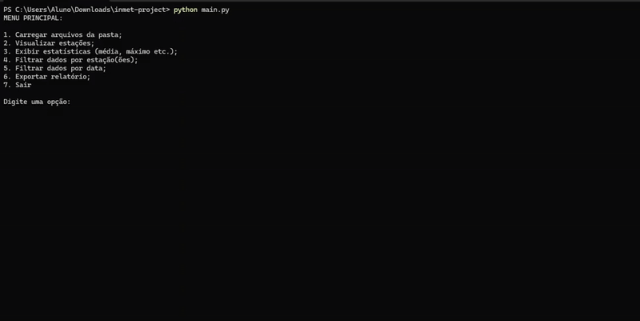
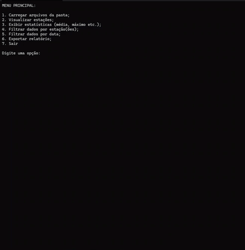
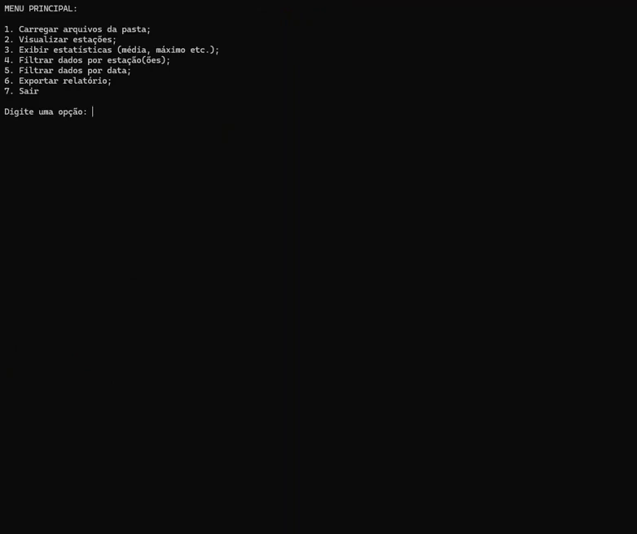
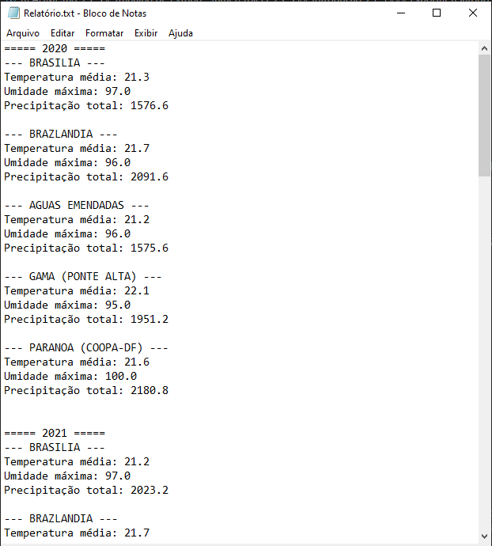
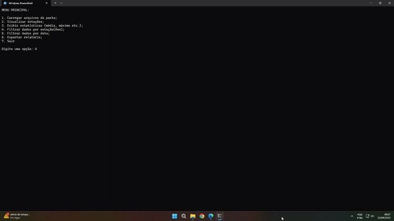

# Trabalho de Python - InmetProject
Esse código foi realizado como trabalho para o 2º Trimestre de 2025 para a aula de Tópicos Especiais do CEFET/RJ Uned Nova Iguaçu.
Os alunos responsáveis pelo trabalho foram [Evelyn Motta](https://github.com/EvelynMotta) e [Pedro Anuda](https://github.com/pedroanuda).

## Introdução
Recomenda-se que a aplicação seja compilada no Terminal através do comando `python main.py`, para que a função Limpar() funcione com excelência
e limpe a tela do terminal quando a sessão for trocada.

Ao iniciar a aplicação o usuário obterá um menu onde terá as seguintes opções:

1. Carregar arquivos da pasta;
2. Visualizar estações;
3. Exibir estatísticas (média, máximo etc.);
4. Filtrar dados por estação(ões);
5. Filtrar dados por data;
6. Exportar relatório;
7. Sair;

É obrigatório realizar o Carregamento dos arquivos antes de filtrar, exibir ou exportar informações. Após o carregamento é recomendado
realizar as filtragens que podem ser tanto por estações quanto por datas (período entre uma data e outra) ou ambos.

Os filtros vão funcionar como filtros globais, logo, operarão nas opções 2, 3 e 6. E os relatórios são exportados para o arquivo "Relatório.txt".
Abaixo se exibirá a forma como cada um funciona.

### Carregar arquivos da pasta
Nessa opção, o código executa o escaneamento da pasta "dados". Nela há de haver as pastas que representam os anos, e dentro delas os arquivos
CSV com registros metereológicos das estações.

### Visualizar estações
Nessa opção, o código exibirá as estações disponíveis em cada ano e suas informações, como região, código, uf etc.

### Exibir estatísticas
Ao usar essa opção, o código irá exibir as estatísticas sobre cada estação em cada ano. Essas estatísticas são sobre temperatura média, umidade máxima e precipitação total.

### Exportar relatório
Essa opção coloca a saída do *Exibir estatísticas* em um arquivo de texto "Relatório.txt".

## Filtrando
Há dois filtros possíveis, o de estações e o de data. Ambos vão afetar todo o código desde a exibição das estações
até a exportação do relatório.

